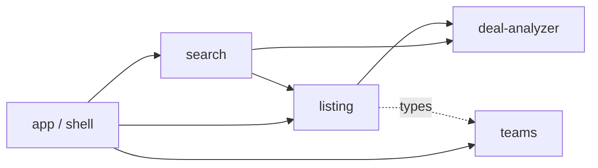
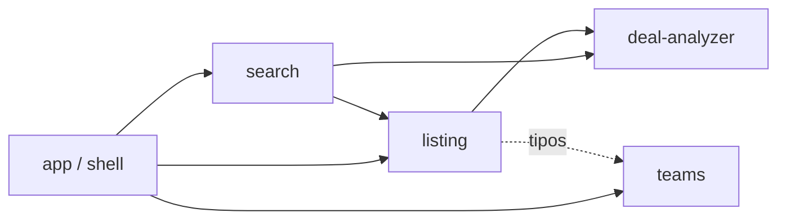

<a id="english"></a>

<div align="center">


<br>

**A demo secondary market for NFL personal seat licenses, with an AI valuation on every listing.**

<br>

[](https://react.dev)
[](https://www.typescriptlang.org)
[](https://vite.dev)
[](https://tailwindcss.com)
[](https://vitest.dev)

**English** · [Español](#espanol)

</div>

---

## What this is

A personal seat licence is the right to buy season tickets for a specific seat. They resell for four and five figures, and the market for them is opaque: a buyer sees an asking price with nothing to compare it against.

**This project is entirely inspired by [pslscout.com](https://pslscout.com/).** The product, the flow, the vocabulary and the shape of the screens are theirs — a real secondary market for NFL seat licences, and a good one. I rebuilt the front end from scratch as a study of it, and then reworked the two things that decide whether a buyer can actually *act* on what they are looking at: the insights that judge a price, and a signal for whether a franchise is worth entering right now. Everything else here exists to give those two something to stand on. It is a homage and an exercise, not a competitor, and not a clone: no code, asset or copy was taken from the original.

**G&D Seats is a frontend demo of what that market looks like with a valuation layer on top.** Pick a franchise, browse its inventory on a seat map, open a listing, read the AI's read on the price, make an offer.

Everything is generated. There is no backend, no database, and no real listing — the data comes from a seeded pseudo-random generator that plays the role a pricing service would. That constraint is stated everywhere it matters, including on the landing screen, because a demo that lets you forget it is a demo is not honest.

> **Two features carry this product.** Everything else is the surface they need in order to mean something. They are the next two sections.

---

## 🧠 Feature 1 — AI Insights *(reworked)*

The panel that opens with every listing. It answers one question: **is this price reasonable, and what should I do about it?**

### What the original already does

PSLScout has insights, and they are genuinely useful. They sit at the **bottom** of a listing as a short run of raw facts:

- how many listings exist
- the price range
- how much cheaper this one is than the others
- the difference against the median

The numbers are right, and the transparency is real. What they leave on the table is the conclusion. They are **passive** — last on the page, easy to scroll past, and they hand the interpretation back to a buyer who has to hold four figures in their head and decide what the combination means.

### What changes here

The insights stop being a footnote and become the **primary decision component**.

| | Original | Here |
|---|---|---|
| **Position** | Bottom of the listing | High-visibility panel, beside the offer box |
| **Content** | Raw statistics | A conclusion, with the statistics as its evidence |
| **Tone** | Neutral figures | Suggestive guidance — never "overpriced", never an order |
| **Work asked of the buyer** | Interpret it yourself | Read the verdict, then check the reasoning behind it |

**The system does not replace the data — it interprets it.** Every number the original shows is still on the screen: the full price history table, the section comparables, the price-statistics chart. Nothing is hidden behind the verdict. The change is that a buyer no longer *has* to do the arithmetic to leave with an answer.

### The verdict

Every listing carries an asking price and an estimated fair value. The analyzer compares them and lands in one of three bands:

| Difference vs. estimate | Verdict | Stance |
|---|---|---|
| More than **+10%** | Above market range | *You may find better value by waiting* |
| Between **−10% and +10%** | In line with market | *Aligned with recent market activity* |
| Less than **−10%** | Attractive value | *Could be a strong opportunity* |

Both boundaries land in **fair**. A listing at exactly +10% is not called out — only one strictly beyond it is. That sounds like a detail and is not: labelling a fairly priced seat "above market" tells a buyer to walk away from a good listing, and the seller loses the sale. There is a test sitting on the boundary from both sides.

### The evidence

Under the verdict sit up to three observations, ranked by magnitude and drawn from the listing's own history:

- *Price adjusted down 9% since Jul 22* — the most recent movement
- *Sits 14% above the section 143 average* — where it lands against comparable seats
- *Adjusted from $75,000 since Mar 25 across 3 revisions* — the shape of the whole history

Three, never more. The panel has a fixed slot beside the offer box, and three bullets that all matter beat five that mostly do not.

The difference from a generic stats block is that each of these is **contextual** (drawn from this listing, not from the market at large), **prioritised** (the largest movement leads), and **scannable** (one clause, one figure, one subject). A buyer who reads only the verdict has an answer; a buyer who reads three more lines knows why.

### Three decisions worth explaining

**The analyzer never estimates.** `estimatedPricePerSeat` is produced by the listing generator, playing the role a backend would. `deal-analyzer` only *evaluates* a given estimate. Keeping the pricing model out of the analyzer is what lets the verdict logic be twelve lines and completely testable.

**The verdict is instant; only the narrative waits.** The listing row behind the modal already showed this exact status and percentage — the maths is pure and synchronous. Staging a loading spinner over a number the user just saw is theatre, and a user who notices stops believing the panel. So the verdict renders in the first frame and the *recommendation and bullets* — the part an AI would genuinely take time to produce — arrive after a deliberate 1.4s. There is a test that advances a fake clock to one millisecond short of the boundary to prove the gate is honest.

**The tone is context, never a warning.** The labels are "Above market range", not "Overpriced". The stance is suggestive, never imperative. Bullets say "adjusted", not "dropped"; "revisions", not "cuts". This is a five-figure purchase, and a panel that frames it as a hazard costs conversion. Two test suites assert a banned-words list against every rendered state — a failure there is treated as a product regression, not a cosmetic one.

### What it does not do

It reads the section **mean**, not the median, which is the more fragile of the two on a skewed price distribution. It has no percentile ranking. Both are known gaps, listed here rather than glossed over.

> **Built to sit on a real backend later.** The verdict deliberately takes an estimate rather than producing one, so a genuine pricing service — real comparables, live inventory, sale history — drops in behind it without the panel changing shape. The point of the layer is that a buyer can close the tab knowing they will not find a better price, offer or piece of advice elsewhere; a stronger backend makes that claim true, and this front end is already built to carry it.

---

## 📈 Feature 2 — Team Popularity Insight *(added)*

Feature 1 reworks something the original already had. This one is an addition: a **second layer of decision-making**, one step earlier in the flow.

Every franchise card carries a read on where that team's market is heading, so the buyer gets an answer before they have opened a single listing: **is this a good team to be buying into right now?**

### Why a team needs a signal at all

A seat licence behaves like an asset, and buyers arrive wanting different things from one:

- some want **stability** — a market that will still be there at this price
- some want **growth** — a franchise on the way up, where the licence appreciates
- some want an **undervalued entry point** — a market that has cooled, bought cheap

A listing page can answer "is this seat priced correctly". It cannot answer any of the three above, because the question is about the franchise, not the seat. This feature puts that context **before** the choice of listing rather than after it.

### How it works

Each franchise gets a seeded 15-point demand series — **12 recorded months plus a 3-month forecast**, anchored so the last recorded point tracks the team's demand index. Momentum is measured across the **forecast** horizon, not the history, because the card answers *what is about to happen*, not what already did.

| Momentum over the forecast | Direction | What the buyer reads |
|---|---|---|
| More than **+3%** | Heating up | Entry cost rising |
| Between **−3% and +3%** | Steady | Prices holding |
| Less than **−3%** | Cooling off | Buyer's market |

A steady market omits the percentage entirely — it rounds to "0%" and reads as missing data rather than as a finding.

### The inversion, which looks like a bug

**A market going up is amber. A market going down is green.**

That is deliberate, and it is the single most likely thing in this codebase to be "fixed" by someone reading it cold. The reader is a **buyer**. A cooling market is where seats get cheaper, so it is the good news. The same convention already governs the AI Insights bullets, where a falling ask scores as positive because it is leverage.

Without the inversion, the same green would mean "good deal" on a listing and "expensive" on a team card, in one product. There is a test pinning it whose comment exists mainly to tell whoever breaks it what they just broke.

### Why the sparkline is gone

The series used to render as an 84×30 sparkline. It was removed: at that size it answered nothing the chip did not already say in words.

The data is **not** dead, though, and deleting it would break two things. Momentum is derived from it. And the tooltip counts the projected points to state its own horizon — so "over the next 3 months" can never drift from the forecast it describes.

> **Built to sit on a real backend later.** The chip consumes a series and a horizon, nothing else — swap the seeded generator for real demand signals (search volume, sell-through, waitlists, results) and the card keeps its shape while the claim behind it gets real. Same goal as the panel: the buyer should not have to check three other sites to be sure they are deciding with the full picture.

---

## Quick start

```bash
pnpm install
pnpm dev
```

| Command | What it does |
|---|---|
| `pnpm dev` | Vite dev server |
| `pnpm build` | Typecheck (`tsc -b`) then build |
| `pnpm test` | Vitest, 154 tests, ~3.5s |
| `pnpm test:watch` | Vitest in watch mode |
| `pnpm typecheck` | `tsc -b` alone |
| `pnpm lint` | ESLint |
| `pnpm logos:sync` | Refresh team marks from ESPN |
| `pnpm og:build` | Rebuild the social card from its SVG (macOS) |

**Before deploying:** set `SITE_URL` in `src/shared/config/site.ts`. Every canonical link, `og:url`, sitemap entry and JSON-LD `@id` is built from it.

---

## Architecture

Domain-driven and feature-first. Four domains plus a shell, with a dependency graph that is kept acyclic by convention:



`teams` has no outgoing edges at all, and `deal-analyzer` depends on nothing. Those two are the leaves the rest is built on.

| Domain | Owns |
|---|---|
| `app/` | Composition root. Screen state, scroll reset, document metadata. No business rules. |
| `teams/` | The 24-franchise catalogue, the grid, and the market-trend signal. |
| `listing/` | The `Listing` entity, the 72-section venue layout, the seat map, the generator, the detail overlay. |
| `search/` | Browse: toolbar, rows, filter and sort. |
| `deal-analyzer/` | The verdict. Pure services plus the panel and the badge. |

`SeatMap` lives in `listing/` and not in `search/` precisely because of this graph — it renders the venue layout, which `listing` owns, and both screens consume it.

**There is no router.** Three screens, one of which is a modal over the results rather than a page. A router would add a dependency to model something the design already shows as an overlay. The one thing it would have given for free — scrolling to the top on a screen change — is done by hand, and the overlay is deliberately excluded so closing a listing returns you to the row you opened.

### Everything is deterministic

All mock data comes from a **seeded** PRNG, never `Math.random()`. This is a product requirement, not a testing convenience: the seat map prints a per-section listing count next to the list it describes, and unseeded data would reshuffle on every render and make those two contradict each other on screen.

The same principle covers the team marks. Real franchise logos come from ESPN, but the app makes **zero runtime requests** for them — `pnpm logos:sync` writes a static map, and the app ships it. The first screen is as deterministic as the rest.

---

## Design decisions

**Status never rides on colour alone.** Green against amber measures ΔE 7.0 under deuteranopia; green against red is ΔE 1.2 in light mode. Every status and tag pairs a glyph with a text label, and single definitions of that pairing are enforced rather than repeated.

**The verdict palette deliberately avoids green/amber/red.** Those read as pass/warn/fail, which frames a five-figure purchase as a hazard. The tokens are amber, blue and teal — and teal is held far enough from the brand green that "attractive value" never reads as the call to action.

**Colour does two opposite jobs here on purpose.** In the price history table, red means the number *fell* — the financial convention. In the verdict badge, the same listing reads teal for "attractive value". They never collide because the prose between them carries no colour at all.

**Dark mode is entirely custom properties.** No `dark:` utilities in components. Two surfaces pin themselves to the dark palette in both themes — the header, whose brand mark is a bright green that a light bar would swallow, and the hero, whose type sits on stadium footage that is dark whatever you picked.

**Every contrast ratio in the theme is measured and annotated in place**, against the surface each token actually renders on.

---

## Testing

154 tests across 25 files, running in about 3.5 seconds.

Each test carries a comment stating what it validates **and why it matters commercially** — not what the code does, but what breaks for a real buyer or seller if it stops being true.

```ts
/**
 * Validates: a difference of exactly +10% is still 'fair'.
 * Why it matters: labelling a fairly priced seat "above market" tells a buyer
 * to walk away from a good listing, and the seller loses the sale.
 */
```

That block is deliberately not on every test. Roughly a third of the suite is bare smoke assertions, and writing the block for those would turn a signal into noise — if the only honest answer to *why it matters* is "so the function keeps working", it does not get one.

### Four files are written as a teaching guide

This part is personal, and it is the reason it exists at all. I annotated four suites line by line — not because the assertions needed explaining, but because **writing the annotation is how I learned the material properly and revisited what I already half-knew**. They are left in the repo in that state on purpose. One technique each:

| File | Teaches |
|---|---|
| `pricing.service.test.ts` | The pure unit test — boundary values, equivalence classes, `toBe` vs `toBeCloseTo` |
| `marketTrend.service.test.ts` | Testing generated data — determinism, self-consistency, invariants, coverage |
| `AIInsightPanel.test.tsx` | Components — `getBy`/`queryBy`/`findBy`, fake timers, querying the accessibility tree |
| `MakeAnOfferCard.test.tsx` | Interaction — `userEvent` vs `fireEvent`, labelled queries, derived state |

Start with `marketTrend.service.test.ts` if you only read one; it covers the genuinely hard part, which is testing a function that invents its own output — there is no expected value to write down, so you assert properties instead.

### The standard is a skill, not a wiki page

`.claude/skills/testing/SKILL.md` encodes the whole convention as a **Claude Code skill**, so it loads automatically whenever a test is being written, extended or reviewed in this repo. It is the four files above compressed into rules: which technique fits which kind of code, the `Validates: / Why it matters:` contract, the query and matcher rules that follow from it, the fixture conventions, and an explicit *Don't* list (no snapshots, no asserting on CSS classes, no pinning counts that are seed luck).

It exists because a testing standard that lives in a document gets read once. This one gets applied on every test that is written after it — including by me, since re-reading my own rules is cheaper than remembering them.

**Commits are gated.** A pre-commit hook runs ESLint over staged files, then `tsc -b`, then the whole suite. Nothing reaches a commit that the build would reject.

---

## Stack

React 19 · TypeScript 6 · Vite 8 · Tailwind CSS 4 · Motion · Vitest + React Testing Library · Radix Tooltip · lucide-react · GSAP (one component) · react-toastify

No chart library — the price statistics chart is inline SVG. No router. No state manager.

---

## Disclaimer

This is a **portfolio demo**. There is no backend, no payment processing, and no real inventory. Every price, listing, seat, price history and demand curve is generated.

Team names, marks and venues are the property of their respective owners. Logos are served from ESPN's public CDN. This project is not affiliated with, endorsed by, or connected to the NFL, any franchise, or [pslscout.com](https://pslscout.com/) — the site this one studies.

---
---

<a id="espanol"></a>

<div align="center">


</div>

# G&D Seats — Español

[English](#english) · **Español**

**Un mercado secundario de demostración para personal seat licenses de la NFL, con una valuación de IA en cada publicación.**

---

## Qué es esto

Un personal seat licence (PSL) es el derecho a comprar abonos de temporada para un asiento específico. Se revenden por cuatro y cinco cifras, y su mercado es opaco: el comprador ve un precio pedido sin nada contra qué compararlo.

**Este proyecto está enteramente inspirado en [pslscout.com](https://pslscout.com/).** El producto, el flujo, el vocabulario y la forma de las pantallas son suyos — un mercado secundario real de PSLs de la NFL, y uno bueno. Reconstruí el frontend desde cero como un estudio de él, y luego rehice las dos cosas que deciden si un comprador puede realmente *actuar* sobre lo que está viendo: los insights que juzgan un precio, y una señal de si vale la pena entrar a una franquicia ahora mismo. Todo lo demás existe para darle a esas dos algo sobre qué pararse. Es un homenaje y un ejercicio, no un competidor, y no un clon: no se tomó ni código, ni assets, ni copy del original.

**G&D Seats es una demo frontend de cómo se ve ese mercado con una capa de valuación encima.** Eliges una franquicia, exploras su inventario sobre un mapa de asientos, abres una publicación, lees la lectura de la IA sobre el precio, y haces una oferta.

Todo está generado. No hay backend, ni base de datos, ni una sola publicación real — los datos vienen de un generador pseudoaleatorio con semilla que hace el papel que haría un servicio de precios. Esa limitación se declara en todos los lugares donde importa, incluida la pantalla de entrada, porque una demo que te deja olvidar que es una demo no es honesta.

> **Dos features sostienen este producto.** Todo lo demás es la superficie que necesitan para significar algo. Son las dos secciones siguientes.

---

## 🧠 Feature 1 — AI Insights *(rehecho)*

El panel que se abre con cada publicación. Responde una sola pregunta: **¿este precio es razonable, y qué debería hacer al respecto?**

### Lo que el sitio original ya hace

PSLScout tiene insights, y son genuinamente útiles. Van al **final** de la publicación, como una lista corta de datos crudos:

- cuántas publicaciones existen
- el rango de precios
- cuánto más barata es esta que las demás
- la diferencia contra la mediana

Los números están bien y la transparencia es real. Lo que dejan sobre la mesa es la conclusión. Son **pasivos** — últimos en la página, fáciles de saltarse de largo, y le devuelven la interpretación a un comprador que tiene que sostener cuatro cifras en la cabeza y decidir qué significan juntas.

### Lo que cambia aquí

Los insights dejan de ser una nota al pie y pasan a ser el **componente principal de decisión**.

| | Original | Aquí |
|---|---|---|
| **Posición** | Al final de la publicación | Panel de alta visibilidad, junto a la caja de oferta |
| **Contenido** | Estadísticas crudas | Una conclusión, con las estadísticas como evidencia |
| **Tono** | Cifras neutras | Guía sugerida — nunca "overpriced", nunca una orden |
| **Trabajo que le pide al comprador** | Interprétalo tú | Lee el veredicto y luego revisa el razonamiento |

**El sistema no reemplaza los datos — los interpreta.** Cada número que muestra el original sigue en pantalla: la tabla completa de historial, los comparables de la sección, la gráfica de estadísticas de precio. Nada queda escondido detrás del veredicto. Lo que cambia es que el comprador ya no *tiene* que hacer la aritmética para irse con una respuesta.

### El veredicto

Cada publicación lleva un precio pedido y un valor justo estimado. El analizador los compara y cae en una de tres bandas:

| Diferencia vs. estimado | Veredicto | Postura |
|---|---|---|
| Más de **+10%** | Above market range | *Podrías encontrar mejor valor esperando* |
| Entre **−10% y +10%** | In line with market | *Alineado con la actividad reciente del mercado* |
| Menos de **−10%** | Attractive value | *Podría ser una oportunidad fuerte* |

Ambos límites caen en **fair**. Una publicación exactamente en +10% no se señala — solo una estrictamente más allá. Suena a detalle y no lo es: etiquetar como "sobre el mercado" un asiento con precio justo le dice al comprador que se aleje de una buena publicación, y el vendedor pierde la venta. Hay un test parado sobre el límite, por ambos lados.

### La evidencia

Bajo el veredicto van hasta tres observaciones, ordenadas por magnitud y extraídas del historial de la propia publicación:

- *Price adjusted down 9% since Jul 22* — el movimiento más reciente
- *Sits 14% above the section 143 average* — dónde cae contra asientos comparables
- *Adjusted from $75,000 since Mar 25 across 3 revisions* — la forma del historial completo

Tres, nunca más. El panel tiene un espacio fijo junto a la caja de oferta, y tres viñetas que todas importan le ganan a cinco que en su mayoría no.

La diferencia contra un bloque genérico de estadísticas es que cada una es **contextual** (sale de esta publicación, no del mercado en general), **priorizada** (el movimiento más grande va primero) y **escaneable** (una cláusula, una cifra, un sujeto). Quien solo lee el veredicto ya tiene respuesta; quien lee tres líneas más sabe por qué.

### Tres decisiones que vale la pena explicar

**El analizador nunca estima.** `estimatedPricePerSeat` lo produce el generador de publicaciones, haciendo el papel de un backend. `deal-analyzer` solo *evalúa* un estimado que recibe. Mantener el modelo de precios fuera del analizador es lo que permite que la lógica del veredicto tenga doce líneas y sea completamente testeable.

**El veredicto es instantáneo; solo la narrativa espera.** La fila detrás del modal ya mostró exactamente este estado y este porcentaje — la matemática es pura y síncrona. Montar un spinner sobre un número que el usuario acaba de ver es teatro, y un usuario que lo nota deja de creerle al panel. Así que el veredicto se renderiza en el primer frame y la *recomendación y las viñetas* — la parte que una IA sí tardaría en producir — llegan tras 1.4s deliberados. Hay un test que adelanta un reloj falso hasta un milisegundo antes del límite para probar que la espera es honesta.

**El tono es contexto, nunca advertencia.** Las etiquetas dicen "Above market range", no "Overpriced". La postura sugiere, nunca ordena. Las viñetas dicen "adjusted", no "dropped"; "revisions", no "cuts". Esta es una compra de cinco cifras, y un panel que la enmarca como un peligro cuesta conversión. Dos suites de tests verifican una lista de palabras prohibidas contra cada estado renderizado — una falla ahí se trata como regresión de producto, no como cosmética.

### Lo que no hace

Lee la **media** de la sección, no la mediana, que es la más frágil de las dos sobre una distribución de precios sesgada. No tiene ranking percentil. Ambas son carencias conocidas, listadas aquí en vez de disimuladas.

> **Pensado para montarse sobre un backend real más adelante.** El veredicto recibe un estimado en vez de producirlo justamente para eso: un servicio de precios de verdad — comparables reales, inventario vivo, historial de ventas — entra por detrás sin que el panel cambie de forma. El objetivo de la capa es que el comprador pueda cerrar la pestaña sabiendo que no va a encontrar mejor precio, mejor oferta ni mejor consejo en otro lado; un backend más potente vuelve cierta esa promesa, y este frontend ya está construido para sostenerla.

---

## 📈 Feature 2 — Team Popularity Insight *(añadido)*

El Feature 1 rehace algo que el original ya tenía. Este es una adición: una **segunda capa de decisión**, un paso antes en el flujo.

Cada tarjeta de franquicia lleva una lectura de hacia dónde va el mercado de ese equipo, así que el comprador tiene una respuesta antes de haber abierto una sola publicación: **¿es un buen equipo para entrar ahora mismo?**

### Por qué un equipo necesita su propia señal

Un PSL se comporta como un activo, y los compradores llegan queriendo cosas distintas de él:

- unos buscan **estabilidad** — un mercado que siga ahí a este precio
- otros buscan **crecimiento** — una franquicia en alza, donde la licencia se aprecia
- otros buscan un **punto de entrada infravalorado** — un mercado que se enfrió, comprar barato

Una página de publicación puede responder "¿este asiento está bien valuado?". No puede responder ninguna de las tres de arriba, porque la pregunta es sobre la franquicia, no sobre el asiento. Este feature pone ese contexto **antes** de elegir publicación, no después.

### Cómo funciona

Cada franquicia recibe una serie de demanda de 15 puntos con semilla — **12 meses registrados más un pronóstico de 3 meses**, anclada para que el último punto registrado siga el índice de demanda del equipo. El momentum se mide sobre el horizonte del **pronóstico**, no sobre el histórico, porque la tarjeta responde *qué está por pasar*, no qué ya pasó.

| Momentum sobre el pronóstico | Dirección | Lo que lee el comprador |
|---|---|---|
| Más de **+3%** | Heating up | Costo de entrada subiendo |
| Entre **−3% y +3%** | Steady | Precios sosteniéndose |
| Menos de **−3%** | Cooling off | Mercado de compradores |

Un mercado estable omite el porcentaje por completo — redondea a "0%" y se lee como dato faltante, no como hallazgo.

### La inversión, que parece un bug

**Un mercado que sube es ámbar. Un mercado que baja es verde.**

Es deliberado, y es lo más probable de este código que alguien "arregle" leyéndolo en frío. El lector es un **comprador**. Un mercado enfriándose es donde los asientos se abaratan, así que es la buena noticia. La misma convención ya gobierna las viñetas de AI Insights, donde un precio que cae puntúa como positivo porque es palanca de negociación.

Sin la inversión, el mismo verde significaría "buena oferta" en una publicación y "caro" en una tarjeta de equipo, dentro de un mismo producto. Hay un test que lo fija, y su comentario existe sobre todo para decirle a quien lo rompa qué acaba de romper.

### Por qué desapareció el sparkline

La serie se dibujaba como un sparkline de 84×30. Se eliminó: a ese tamaño no respondía nada que el chip no dijera ya con palabras.

Los datos **no** están muertos, y borrarlos rompería dos cosas. El momentum se deriva de ellos. Y el tooltip cuenta los puntos proyectados para declarar su propio horizonte — así "durante los próximos 3 meses" nunca puede desalinearse del pronóstico que describe.

> **Pensado para montarse sobre un backend real más adelante.** El chip consume una serie y un horizonte, nada más — cambia el generador con semilla por señales de demanda reales (volumen de búsqueda, velocidad de venta, listas de espera, resultados deportivos) y la tarjeta conserva su forma mientras la afirmación detrás se vuelve real. Mismo objetivo que el panel: que el comprador no tenga que revisar otros tres sitios para estar seguro de que está decidiendo con el panorama completo.

---

## Arranque rápido

```bash
pnpm install
pnpm dev
```

| Comando | Qué hace |
|---|---|
| `pnpm dev` | Servidor de desarrollo de Vite |
| `pnpm build` | Typecheck (`tsc -b`) y luego build |
| `pnpm test` | Vitest, 154 tests, ~3.5s |
| `pnpm test:watch` | Vitest en modo watch |
| `pnpm typecheck` | Solo `tsc -b` |
| `pnpm lint` | ESLint |
| `pnpm logos:sync` | Refresca los escudos desde ESPN |
| `pnpm og:build` | Regenera la tarjeta social desde su SVG (macOS) |

**Antes de desplegar:** define `SITE_URL` en `src/shared/config/site.ts`. Cada canonical, `og:url`, entrada del sitemap y `@id` de JSON-LD se construye desde ahí.

---

## Arquitectura

Orientada a dominios, feature-first. Cuatro dominios más un shell, con un grafo de dependencias que se mantiene acíclico por convención:



| Dominio | Posee |
|---|---|
| `app/` | Raíz de composición. Estado de pantalla, reset de scroll, metadata del documento. Sin reglas de negocio. |
| `teams/` | El catálogo de 24 franquicias, la grilla, y la señal de tendencia de mercado. |
| `listing/` | La entidad `Listing`, el estadio de 72 secciones, el mapa de asientos, el generador, el overlay de detalle. |
| `search/` | Explorar: toolbar, filas, filtro y orden. |
| `deal-analyzer/` | El veredicto. Servicios puros más el panel y el badge. |

`SeatMap` vive en `listing/` y no en `search/` precisamente por este grafo — renderiza el layout del estadio, que `listing` posee, y ambas pantallas lo consumen.

**No hay router.** Tres pantallas, una de las cuales es un modal sobre los resultados, no una página. Un router agregaría una dependencia para modelar algo que el diseño ya muestra como overlay. Lo único que habría dado gratis — hacer scroll al tope al cambiar de pantalla — se hace a mano, y el overlay queda deliberadamente excluido para que cerrar una publicación te devuelva a la fila que abriste.

### Todo es determinista

Todos los datos simulados vienen de un PRNG **con semilla**, nunca de `Math.random()`. Esto es un requisito de producto, no una comodidad de testing: el mapa de asientos imprime un conteo por sección junto a la lista que describe, y datos sin semilla se rebarajarían en cada render y harían que ambos se contradijeran en pantalla.

El mismo principio cubre los escudos. Los logos reales vienen de ESPN, pero la app hace **cero peticiones en runtime** para ellos — `pnpm logos:sync` escribe un mapa estático y la app lo publica. La primera pantalla es tan determinista como el resto.

---

## Decisiones de diseño

**El estado nunca viaja solo en el color.** Verde contra ámbar mide ΔE 7.0 bajo deuteranopía; verde contra rojo es ΔE 1.2 en modo claro. Cada estado y cada etiqueta emparejan un glifo con una etiqueta de texto, y ese emparejamiento se define una sola vez en vez de repetirse.

**La paleta del veredicto evita verde/ámbar/rojo a propósito.** Esos se leen como pass/warn/fail, lo que enmarca una compra de cinco cifras como un peligro. Los tokens son ámbar, azul y teal — y el teal se mantiene suficientemente lejos del verde de marca para que "valor atractivo" nunca se lea como el llamado a la acción.

**El color hace dos trabajos opuestos aquí a propósito.** En la tabla de historial, rojo significa que el número *bajó* — la convención financiera. En el badge del veredicto, esa misma publicación se lee teal como "valor atractivo". Nunca chocan porque la prosa que va entre ambos no lleva color alguno.

**El modo oscuro son puras custom properties.** Sin utilidades `dark:` en los componentes. Dos superficies se fijan a la paleta oscura en ambos temas — el header, cuyo escudo es un verde brillante que una barra clara se tragaría, y el hero, cuyo texto va sobre metraje de estadio que es oscuro elijas lo que elijas.

**Cada ratio de contraste del tema está medido y anotado en el lugar**, contra la superficie sobre la que cada token realmente se renderiza.

---

## Testing

154 tests en 25 archivos, corriendo en unos 3.5 segundos.

Cada test lleva un comentario que dice qué valida **y por qué importa comercialmente** — no qué hace el código, sino qué se rompe para un comprador o un vendedor real si deja de ser cierto.

```ts
/**
 * Validates: a difference of exactly +10% is still 'fair'.
 * Why it matters: labelling a fairly priced seat "above market" tells a buyer
 * to walk away from a good listing, and the seller loses the sale.
 */
```

Ese bloque deliberadamente no está en todos los tests. Cerca de un tercio de la suite son aserciones de humo, y ponerles el bloque convertiría una señal en ruido — si la única respuesta honesta a *por qué importa* es "para que la función siga funcionando", no lleva bloque.

### Cuatro archivos están escritos como guía de estudio

Esta parte es personal, y es la razón de que exista. Anoté cuatro suites línea por línea — no porque las aserciones necesitaran explicación, sino porque **escribir la anotación fue la forma en que aprendí bien el material y repasé lo que ya sabía a medias**. Se quedan en el repo en ese estado a propósito. Una técnica cada uno:

| Archivo | Enseña |
|---|---|
| `pricing.service.test.ts` | El test unitario puro — valores límite, clases de equivalencia, `toBe` vs `toBeCloseTo` |
| `marketTrend.service.test.ts` | Testear datos generados — determinismo, autoconsistencia, invariantes, cobertura |
| `AIInsightPanel.test.tsx` | Componentes — `getBy`/`queryBy`/`findBy`, timers falsos, consultar el árbol de accesibilidad |
| `MakeAnOfferCard.test.tsx` | Interacción — `userEvent` vs `fireEvent`, consultas por etiqueta, estado derivado |

Empieza por `marketTrend.service.test.ts` si solo vas a leer uno; cubre la parte genuinamente difícil, que es testear una función que inventa su propia salida — no hay valor esperado que escribir, así que se afirman propiedades en su lugar.

### El estándar es una skill, no una página de wiki

`.claude/skills/testing/SKILL.md` codifica toda la convención como una **skill de Claude Code**, así que se carga sola cada vez que en este repo se escribe, se amplía o se revisa un test. Es la destilación de los cuatro archivos de arriba en reglas: qué técnica corresponde a qué tipo de código, el contrato `Validates: / Why it matters:`, las reglas de queries y matchers que se derivan de él, las convenciones de fixtures, y una lista explícita de *Don't* (sin snapshots, sin afirmar sobre clases CSS, sin fijar conteos que son suerte de la semilla).

Existe porque un estándar de testing que vive en un documento se lee una vez. Este se aplica en cada test que se escriba después de él — incluido por mí, porque releer mis propias reglas sale más barato que acordarme de ellas.

**Los commits están bloqueados.** Un hook de pre-commit corre ESLint sobre los archivos en staging, luego `tsc -b`, luego la suite completa. Nada llega a un commit que el build fuera a rechazar.

---

## Stack

React 19 · TypeScript 6 · Vite 8 · Tailwind CSS 4 · Motion · Vitest + React Testing Library · Radix Tooltip · lucide-react · GSAP (un solo componente) · react-toastify

Sin librería de gráficas — la gráfica de estadísticas de precio es SVG inline. Sin router. Sin gestor de estado.

---

## Aviso

Esto es una **demo de portafolio**. No hay backend, ni procesamiento de pagos, ni inventario real. Cada precio, publicación, asiento, historial y curva de demanda está generado.

Los nombres de equipos, escudos y estadios son propiedad de sus respectivos dueños. Los logos se sirven desde el CDN público de ESPN. Este proyecto no está afiliado, avalado ni conectado con la NFL, con ninguna franquicia, ni con [pslscout.com](https://pslscout.com/) — el sitio que estudia.
